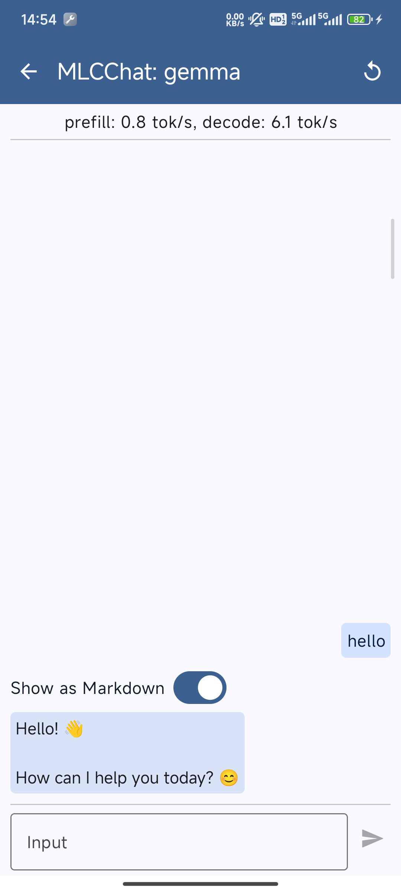

# MLC-LLM Android

本项目是一个通过 [mlc-llm](https://github.com/mlc-ai/mlc-llm) 编译过的可以直接运行的android app,
具有运行本地部署的大模型进行对话的能力。

# 下载项目

```bash
git lfs install
git clone https://github.com/QQQQQQY/MLCChat.git
```

# 使用方法

1. 编译运行app 将生成的 apk 文件安装到手机上。

   这个时候打开安装完成的app, 会发现列表中没有模型, 这是因为我们还没有配置好模型。而且会出现一个要求去下载模型的弹窗,
   弹窗我们关闭掉就行。
2. 将项目中的 [gemma-2-2b-it-q4f16_1-MLC](./llm/gemma-2-2b-it-q4f16_1-MLC)
   整个目录复制到手机中的 `/Android/data/ai.mlc.mlcchat/files` 目录下
   复制完成后的目录结构如下:
   ```
   Android
       └── data
           └── ai.mlc.mlcchat
               └── files
                   └── gemma-2-2b-it-q4f16_1-MLC
                       ├── mlc-chat-config.json
                       ├── ...
                       └── ...
   ```
3. 重新打开 app, 这个时候我们就能看到模型列表了。
4. 等待初始化完成, 这个时候我们就可以开始使用本地大模型进行对话了。
5. 本项目默认配置了 `gemma-2-2b-it-q4f16_1-MLC` 模型,

   如果你想使用其他的模型, 可以按照下面步骤:
    1. 在 [hf-mirror](https://hf-mirror.com/) 下载你需要配置的其他模型, 注意:
       需要是转换过权重的以 `-MLC` 结尾的模型。
    2. 修改 [mlc-app-config.json](./dist/lib/mlc4j/src/main/assets/mlc-app-config.json) 文件,
       将你下载的模型配置进去。
    3. 重新编译运行 app。
    4. 复制你下载的大模型到手机中的 `/Android/data/ai.mlc.mlcchat/files` 目录下。
    5. 重新打开 app, 这个时候我们就能看到新添加的模型了。

附: 